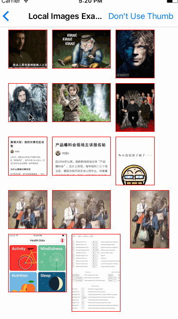

[](https://github.com/cuzv/PhotoBrowser/blob/master/LICENSE)
[](https://github.com/CocoaPods/CocoaPods)
[](https://github.com/Carthage/Carthage)
[](https://weibo.com/cuzval/)
[](https://twitter.com/cuzval)

# PhotoBrowser

PhotoBrowser is a light weight photo browser, like the wechat, weibo image viewer.

### Features

-   [x] Present & Dismissal animation & gesture
-   [x] GIF support
-   [x] Display long picture

## How does it look like?

<p align="left">
&nbsp;&nbsp;
</p>

## Usage

- Like the `UITableView` API, We have `DataSource` an `Delegate` for load data and handle action
- Tell `PhotoBrowser` how many pages would you like to present by conforms protocol `PBViewControllerDataSource` and implement `numberOfPagesInViewController:` selector
- Optional set the initialize page by `pb_startPage` property
- Use for static Image - Conforms protocol `PBViewControllerDataSource` and implement `viewController:imageForPageAtIndex:` selector
- Use for web image - Conforms protocol `PBViewControllerDataSource` and implement `viewController:presentImageView:forPageAtIndex:progressHandler` selector
- Support animation - Conforms protocol `PBViewControllerDataSource` and implement `thumbViewForPageAtIndex:` tell the start and ended imageView position
- Action callbacks - Conforms protocol `PBViewControllerDelegate` and implement `viewController:didSingleTapedPageAtIndex:presentedImage:` or `viewController:didLongPressedPageAtIndex:presentedImage:` handle single tap or long press action

## Demo code

``` objective-c
...
PBViewController *pbViewController = [PBViewController new];
// Use your own subclass of UIImageView to display.
pbViewController.imageViewClass = PBImageView.class;
pbViewController.pb_dataSource = self;
pbViewController.pb_delegate = self;
pbViewController.pb_startPage = sender.tag;
[self presentViewController:pbViewController animated:YES completion:nil];
...

...
#pragma mark - PBViewControllerDataSource

- (NSInteger)numberOfPagesInViewController:(PBViewController *)viewController {
    return self.frames.count;
}

- (void)viewController:(PBViewController *)viewController presentImageView:(UIImageView *)imageView forPageAtIndex:(NSInteger)index progressHandler:(void (^)(NSInteger, NSInteger))progressHandler {
    NSString *url = [NSString stringWithFormat:@"https://raw.githubusercontent.com/cuzv/PhotoBrowser/dev/Example/Assets/%@.jpg", @(index + 1)];
    UIImage *placeholder = self.imageViews[index].image;
    [imageView sd_setImageWithURL:[NSURL URLWithString:url]
                 placeholderImage:placeholder
                          options:0
                         progress:progressHandler
                        completed:^(UIImage *image, NSError *error, SDImageCacheType cacheType, NSURL *imageURL) {
                        }];
}

- (UIView *)thumbViewForPageAtIndex:(NSInteger)index {
    if (self.thumb) {
        return self.imageViews[index];
    }
    return nil;
}

#pragma mark - PBViewControllerDelegate

- (void)viewController:(PBViewController *)viewController didSingleTapedPageAtIndex:(NSInteger)index presentedImage:(UIImage *)presentedImage {
    [self dismissViewControllerAnimated:YES completion:nil];
}
```

For more information checkout the Example in project.

## License

`PhotoBrowser` is available under the MIT license. See the LICENSE file for more info.
